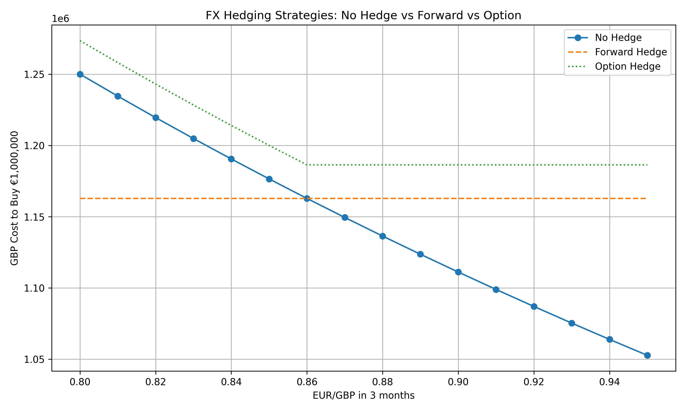

# FX Hedging Demo ⚖️  

Python simulation of hedging a €1m foreign currency payment with **forwards and options**, including payoff tables, decision metrics, and visualisation.

---

## Key Features  

- Scenario modelling for a UK company with a €1m exposure due in 3 months.  
- Three strategies compared:  
  - **No hedge** → full market exposure  
  - **Forward hedge** → locked rate  
  - **Call option hedge** → downside protection + upside flexibility  
- Decision metrics: worst-case cost, best-case cost, forward vs option breakeven rate.  
- Automated outputs: payoff table (`CSV`), comparison chart (`PNG`), and metrics summary (`TXT`).  

---

## Overview  

This self-directed project demonstrates how corporates can manage **FX risk** using forwards and options. I built a Python model to compare the GBP cost of a €1m payment under different EUR/GBP outcomes, showing the trade-offs between **certainty, flexibility, and premium cost**.  

By presenting results as a table, chart, and metrics summary, I mirrored the way a risk desk or sales team would present hedging options to a CFO — balancing theory, coding, and communication.  

---

## Why I Chose This Project  

I wanted to showcase a project beyond trading strategies that still connects directly to **real-world market roles**. FX hedging sits at the intersection of corporate finance and markets — and it’s exactly the kind of problem a junior in **sales & trading** or **risk management** would need to explain to a client.  

---

## Problem Statement  

Unhedged FX exposures create uncertainty: if the euro strengthens, a UK company faces higher GBP costs to settle euro payments. My goals were to:  

- Simulate payoffs under multiple EUR/GBP scenarios.  
- Show how a forward removes uncertainty but sacrifices upside.  
- Show how an option caps downside while keeping upside, but at a cost.  
- Highlight breakeven levels where the option beats the forward.  

---

## Business Context  

- **Forwards**: used by corporates for budget certainty.  
- **Options**: bought as “insurance” when firms want protection but flexibility.  
- **Unhedged**: risky but occasionally cheaper.  

Banks present this analysis to clients daily; being able to explain it clearly is valuable for roles in **markets, treasury, and structuring**.  

---

## Data & Tools Used  

| Category   | Details |
|------------|---------|
| Inputs     | Scenario: €1m payable in 3 months, spot = 0.85, forward = 0.86, option premium = 2% |
| Languages  | Python |
| Libraries  | Pandas, NumPy, Matplotlib |
| Outputs    | `payoff_table.csv`, `hedging_comparison.png`, `decision_metrics.txt` |

---

## Methodology  

- Defined a base scenario (UK firm, €1m, 3 months).  
- Created payoff functions for **no hedge, forward, and option**.  
- Simulated EUR/GBP rates between 0.80–0.95.  
- Calculated GBP costs for each strategy.  
- Built a payoff table and plotted results.  
- Calculated **decision metrics** (forward cost, option max/min, breakeven).  
- Saved results for reproducibility.  

---

## Results  

- **Forward hedge**: fixed cost = £1,162,791.  
- **Option hedge**:  
  - Max cost = £1,186,320 (strike + premium).  
  - Min cost (grid) = £1,076,161 (euro weakens, premium still paid).  
  - Breakeven vs forward = EUR/GBP 0.8778.  
- **Unhedged**: ranged between £1,250,000 (euro strengthens) and £1,052,632 (euro weakens).  

📊 The **chart** makes these trade-offs clear:  
- Forward = flat line.  
- Option = kinked curve with premium.  
- No hedge = downward slope (full risk).  

---

## Key Challenges & Solutions  

- **Challenge**: Making option logic realistic (exercise vs market).  
- **Solution**: Implemented branch logic + premium cost.  
- **Challenge**: Explaining finance concepts clearly in code.  
- **Solution**: Structured code with comments, payoff tables, and charts.  

---

## Takeaways  

- Strengthened ability to connect **derivative theory** with **practical modelling**.  
- Learned how to present financial results in **client-ready outputs** (tables, charts, summaries).  
- Demonstrated both **technical coding** and **financial explanation** skills.  

---

## Improvements  

Next, I plan to:  
- Replace fixed premium with **Garman–Kohlhagen option pricing**.  
- Extend to more complex hedging portfolios (multiple currencies).  
- Add Monte Carlo simulation to model distributions of hedging costs.  

## Results

**Decision Metrics**
- Forward cost (locked): £1,162,791  
- Option max cost: £1,186,320  
- Option min cost (grid): £1,076,161  
- Breakeven (Option vs Forward): 0.8778 EUR/GBP  

**Payoff Table (excerpt)**

| EUR/GBP in 3m | No Hedge (GBP) | Forward Hedge (GBP) | Option Hedge (GBP) |
|---------------|----------------|----------------------|---------------------|
| 0.80          | 1,250,000      | 1,162,791            | 1,273,529           |
| 0.85          | 1,176,471      | 1,162,791            | 1,200,000           |
| 0.90          | 1,111,111      | 1,162,791            | 1,186,320           |
| 0.95          | 1,052,632      | 1,162,791            | 1,186,320           |

*(full CSV in `results/payoff_table.csv`)*

